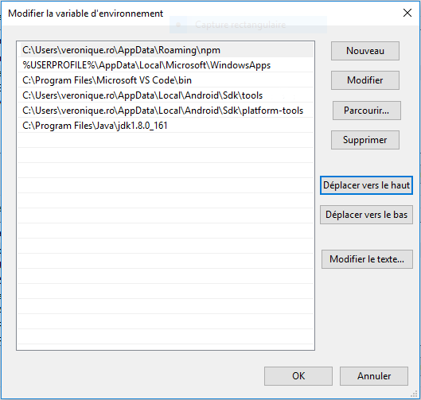
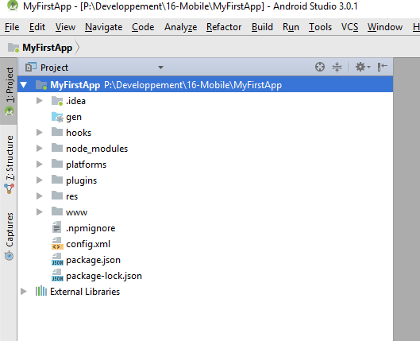
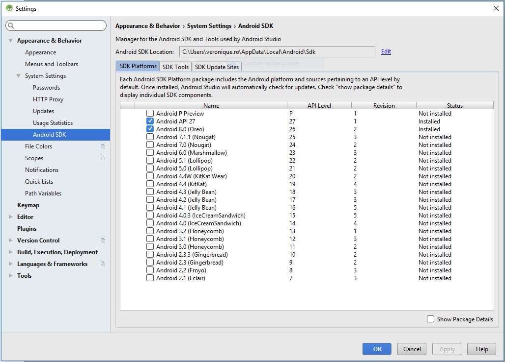
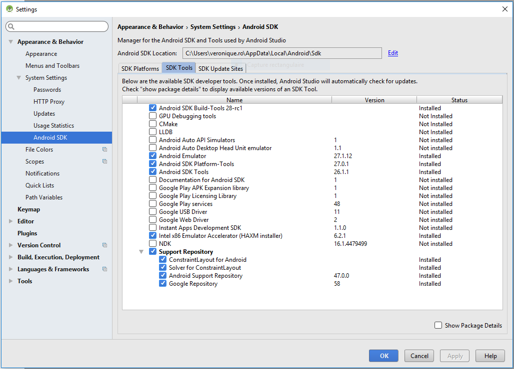
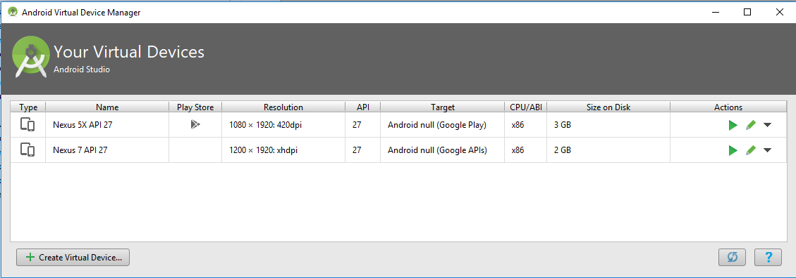
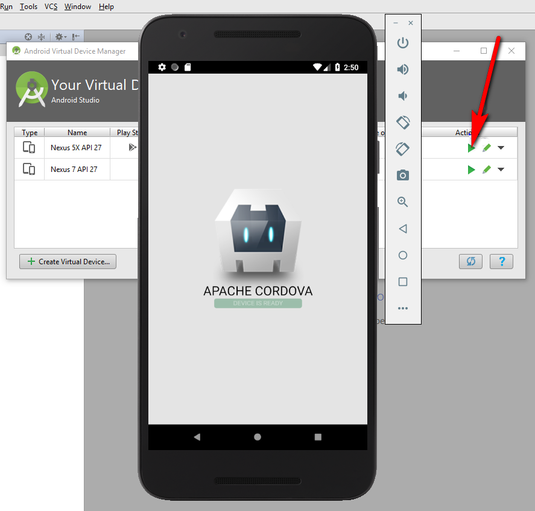

# Mémo - ANDROID - Environnement de développement

## *Campus Numérique 2018 - VR*
#

## Installer Android Studio en configuration "standard"

* Télécharger Android Studio : <a href="https://developer.android.com/studio/index.html" target="_blank">Lien téléchargement ici</a>
* Aide à l'installation : <a href="https://developer.android.com/studio/install.html" target="_blank">Lien aide ici</a>


## Installer Node.js

* Télécharger Node.js : <a href="https://nodejs.org/fr/" target="_blank">Lien téléchargement ici</a>


## Installer Cordova 

* Infos : <a href="http://cordova.apache.org/docs/en/latest/guide/platforms/android/index.html" target="_blank">Lien installation ici</a>

* Infos : <a href="http://cordova.apache.org/docs/en/latest/guide/platforms/android/index.html#installing-the-requirements" target="_blank">Lien installation ANDROID ici</a>

### Installer JDK (Java Development Kit)

* Télécharger la version de Java adaptée : <a href="http://www.oracle.com/technetwork/java/javase/downloads/jdk8-downloads-2133151.html" target="_blank">Lien téléchargement ici</a>

### Installer Cordova 

* Ouvrir un Bash, vérifier la présence de Node.js
```
node -v
```

* Installer Cordova en global sur le PC (-g) :
```
npm install -g cordova
```

* Changer le PATH 
	* Windows + PATH
	* Paramètres système avancés + Variables d'environnement
	* Récupérer les chemins :
        - de NPM 
        ```
        C:\Users\veronique.ro\AppData\Roaming\npm
        ```
        - de SDK Android :
        ```
        C:\Users\veronique.ro\AppData\Local\Android\Sdk\tools
        C:\Users\veronique.ro\AppData\Local\Android\Sdk\platform-tools
        ```
	* Choisir "Nouveau" et copier le chemin
	* Déplacer vers le haut de la liste



# Projet Application

Informations sur la création d'un projet : <a href="http://cordova.apache.org/#getstarted" target="_blank">Lien infos</a>

## Créer un projet CORDOVA "Vide"

Ligne de commande pour la création du dossier complet de l'App
```
cordova create MyFirstApp
```


## Ajouter les plateformes Android et Browser

Se positionner dans le dossier MyFirstApp

Ajouter une plateforme web : 
```
cordova platform add browser 
```
Ajouter une plateforme Android : 
```
cordova platform add android
```

## lancer le projet pour la plate-forme Web

```
cordova run browser 
```

Le projet compilé se lance sur : http://localhost:8001

## Emulation d'un projet sous Android 

Pour voir fonctionner notre projet sur notre PC comme sur un mobile Android il est nécessaire d'avoir une émulation Android.

Modification du BIOS pour accepter les projets virtuels :

* Redémarrer l'ordinateur et pendant le redémarrage appuyer 2 ou 3 fois sur "Echap"
* Dans le menu qui s'ouvre aller dans BIOS SetUp en cliquant ou appuyer sur F10
* Aller dans l'onglet "Advanced"
* Choisir "Systems Options"
* Cocher les  cases "Virtualization"
* Save (puis confirmer l'enregistrement)

## Créer un mobile virtuel sous Android Studio

```
cordova run android 
```
Pour vérifier que Cordova compile bien le projet pour Android

1. Ouvrir le projet Cordova créé dans Android Studio
2. Afficher le projet (onglet projet)

    
3. Cocher dans le setting `SDK Platforms` la version d'Android souhaitée 

    

4. Cocher dans le setting `SDK Tools` Android SDK Build-Tools (1) 

    

5. Création d'un mobile virtuel dans Tools/Android/AVD Manager

    [Création du Mobile Virtuel](https://developer.android.com/studio/run/managing-avds.html)

    * Installer les versions souhaitées pour chaque mobiles créés
    * Lancer le projet dans le mobile créé avec le triangle vert 

    
    


