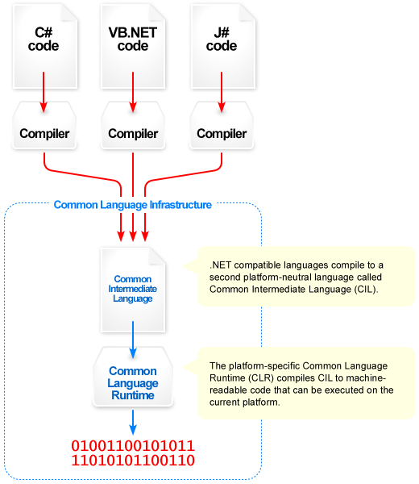

# Mémo C# .Net - HelloWorld
## *Campus Numérique 2018 - Véronique*
#
## Ressources en ligne

* [Cours sur Open ClassRoom](https://openclassrooms.com/fr/courses/218202-apprenez-a-programmer-en-c-sur-net/217501-les-winforms-ou-windows-forms)
* [Documentation Microsoft](https://docs.microsoft.com/fr-fr/visualstudio/ide/quickstart-visual-basic-console)

## Fonctionnement interne de .net

Le C# est un langage à mi-chemins entre des langages compilés et interprétés : ils ne sont pas directement compilé en langage machine, mais il ne sont pas non plus interprétés !

En réalité, ils vont être compilés en un langage intermédiaire (appelé IL pour "Intermediate Language"). Lors de l'exécution ce langage intermédiaire va être compilé en langage machine et exécuté par le CLR (Common Language Runtime), ce "runtime" va en quelque sorte faire l'intermédiaire entre notre code et le système d'exploitation en apportant une importante abstraction vis à vis de fonctions systèmes de bases (entrés/sorties, gestion de la mémoire, etc...).

est un langage compilé, c'est à dire qu'après avoir écrit le code, il est nécessire d'utiliser un compilateur qui transformera le programme en langage machine compris par le processeur.

Si une modification doit être apportée au programme, il faudra compiler à nouveau le code source.

Mais une fois compilé, le programme n'aura plus besoin de rien d'autres pour fonctionner.




<details>
 <summary>Exemple de menu déroulant ( cliquer pour dérouler )</summary>
 
```js
	ici je mets du code caché !
```
</details>

### Horizontal Rule

Three or more...

---