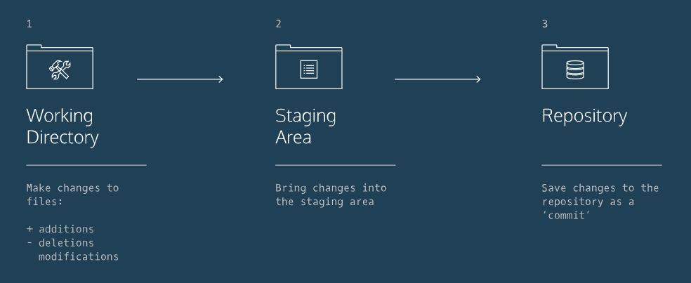

# Mémo GIT
## *Campus Numérique 2018 - Véronique*
#
## Ressources en ligne

[Documentation officielle](https://git-scm.com/doc).

[Cours OpenClassrooms](https://openclassrooms.com/courses/gerez-vos-codes-source-avec-git).

## Le fonctionnement
`Github` est une plate-forme payante pour héberger et partager des projets Git.
`Git` est un logiciel libre (créé par l’auteur du noyau Linux) pour gérer les versions de projets partagés entre plusieurs utilisateurs/créateurs distants. Il est autonome et ne dépend pas du réseau.
*A noter* : Il existe d’autres plates-formes ayant les mêmes fonctionnalités que Github tels que  `Gitlab` ou `Bitbucket` . Sur cette dernière, il est possible de créer 5 projets gratuitement. 

.

* Le `« Working Directory »` est le répertoire de travail local de git.
* La `« Staging Area »` est une zone tampon entre les fichiers modifiés et le dossier git localisé. 
* Le `« Repository »` est la zone de dépôt locale avant transfert sur la plate-forme de partage.

### Tables

Colons can be used to align columns.

| Tables        | Are           | Cool  |
| ------------- |:-------------:| -----:|
| col 3 is      | right-aligned | $1600 |
| col 2 is      | centered      |   $12 |
| zebra stripes | are neat      |    $1 |

There must be at least 3 dashes separating each header cell.
The outer pipes (|) are optional, and you don't need to make the 
raw Markdown line up prettily. You can also use inline Markdown.

Markdown | Less | Pretty
--- | --- | ---
*Still* | `renders` | **nicely**
1 | 2 | 3

### Horizontal Rule

Three or more...

---