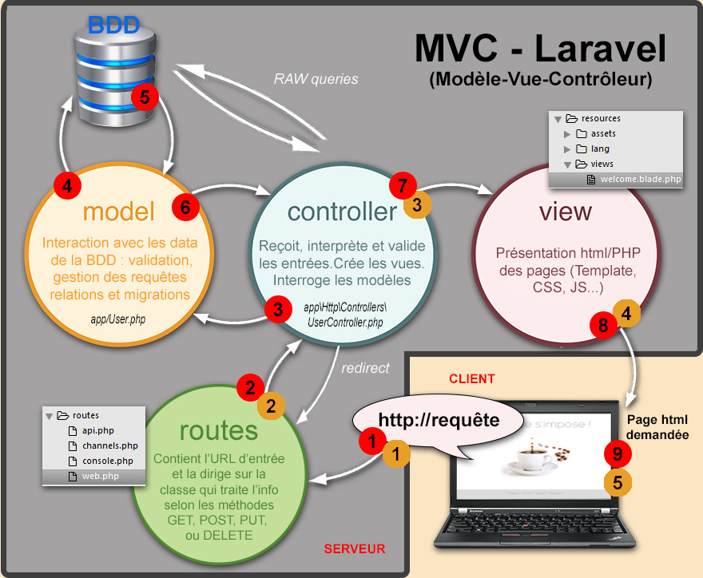
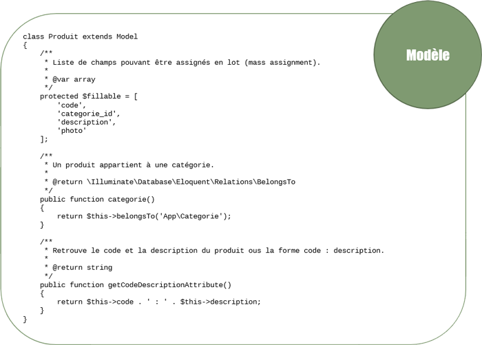
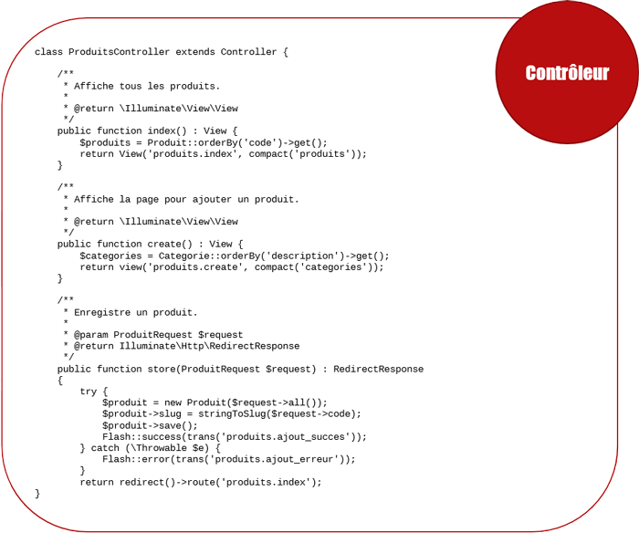

# Mémo MVC avec le FRAMWORK LARAVEL
## *Campus Numérique 2018 - Véronique ROUAULT*
#
##
## Qu'est-ce que MVC ?
MVC est un patron de conception permettant de séparer une application Web en différentes couches : `le Modèle, la Vue et le Contrôleur`.

.

## Le modèle (accès aux données)

Le modèle est la couche représentant les données.

Le modèle consiste en une série de classes. Si les données sont tirées de la BD, chacune des classes représentera une table.

Parmi les fonctionnalités codées dans le modèle, on retrouve les relations entre les tables. 

.

## La vue (interface utilisateur)

La vue est constituée de balises HTML qui représentent ce qui sera affiché à l'écran.

En plus des balises HTML, la vue peut utiliser des directives et instructions prévues par le moteur d'affichage afin d'effectuer différentes opérations, comme par exemple tester une condition ou encore boucler dans les données fournies par le modèle.

La vue pourra faire appel à des ressources externes, comme des feuilles de style, des fichiers JavaScript, des images, etc.

Sous Laravel, le moteur d'affichage s'appelle `Blade`.
.

## Le contrôleur (traitement)

Le contrôleur est en charge d'effectuer les traitements. Il s'agit de l'élément central du patron de conception MVC.

C'est le contrôleur qui retrouvera les données à l'aide du `modèle` et qui les passera à la `vue` pour les afficher.

Inversement, le `contrôleur` recevra les données saisies dans la `vue` et les enregistrera dans la `base de données` à l'aide du `modèle`.

En plus des échanges entre le `modèle` et la `vue`, le `contrôleur` pourra effectuer toutes sortes de tâches, comme l'envoi de courriels, l'ajout d'entrées dans le fichier de log, l'exécution d'un algorithme quelconque, etc.

.

## Installer composer
Installation avec les commandes sous git bash avec l'install de Windows

`Attention` : se placer dans le dossier où l'on veut travailler avant de lancer la ligne de commande

Sous Windows utiliser [Composer-Setup.exe](https://getcomposer.org/download/)

Il suffira de taper *composer* dans git bash pour lancer une commande en ligne.


```
@ECHO OFF
php C:\composer.phar" %*
```
[Tuto d'installation en français](https://www.formations-laravel.fr/articles/decouverte/2017-01-12-installation-d-un-projet-laravel-avec-windows.html)

## Qu'est-ce que composer ?

Composer est un gestion de dépendances pour PHP.

C'est un système qui permet de définir les différentes librairies dont a besoin une application PHP pour fonctionner.

Composer se charge de les télécharger avec son autoloader intégré.
Il permet aussi d'installer des librairies personnelles.

Pour télécharger une librairie supplémentaire, aller sur le site :   [packagist.org](https://packagist.org/)

* Les librairies s'installent dans le dossier *vendor*
* Les fonctions qui permettent de télécharger les librairies sont enregistrées dans le fichier *composer.json*. elles peuvent être utiles surtout en phase de développement.


## Installation : Création du projet
```
composer create-project --prefer-dist laravel/laravel +nom du projet
```
Installe Laravel et crée un nouveau projet (sans la partie développement. commande --prefer-dist)

NB : A chaque nouveau projet il faut installer `Laravel` et `composer` car les projets LARAVEL sont indépendants les uns des autres.    

Lorsque l'on clone pour la première fois un projet depuis `git`, il est nécessaire de faire la commande pour récupérer le dossier `/vendor` ignoré par le `.gitignore`
```
composer install
```
NB : Si le `.env` n’existe pas, il faut copier le `.env.example` et renommer la copie en `.env`.    
Le `.env` sert à définir l’environnement du projet.     
Il ne doit pas être versionné sur github cra il contient les données propres à l'environnement du projet avec notamment des données sensibles comme le mot de passe.    
L'ajouter au `gitignore` s'il n'y est pas (par défault)

## Lancer le serveur
```
php artisan serve
```
## Installation de la débugbar
```
composer require barryvdh/laravel-debugbar --dev
```
Relancer le serveur et rafraichir la page.
## Configuration de l’éditeur (Visual Studio Code)
Installer l'extension
```
Laravel Blade Syntax Highlighting
```
## Grands principes de LARAVEL
Le trio gagnant du framework
1. Les `Routes`     
Elles définissent le chemin avec des `get` (récupérer) ou des `post` (envoyer) et passe un controlleur   

```
/routes
```
```php
Route::get('/lien-afficher','NomduController@functiondanslecontrolleur');
```
2. Les `Controller`     
Ils font les traitements et leur objectif est de retourner une vue
```
/app/Http/Controllers
```
```php
<?php

namespace App\Http\Controllers;

use Illuminate\Http\Request;
use App\Boisson;// lien vers la classe Boisson

class BoissonController extends Controller
{
    // Méthode pour lister les boissons avec le Model
    function afficheBoissons() {
        
        $boissons = Boisson::all();// Appelle la classe pour ajouter toutes les données

        return view('boissons.lister-boissons', ['boissons'=>$boissons]);// retourne la vue (avec . pour remplacer /) avec un paramètre passé
    
    }
}
?>
```
3. Les `Vues`       
Ce sont les pages visibles du site
```
/resources/views
```
## Les template
Un `template` est un squelette `html` des pages à afficher    
Il utilise une base classique `html + head + body + footer` 
On utilisera des mots clés pour appeler les informations à y afficher

Pour appeler le template du menu ou du footer dans le template principal
```php
@include('template.menu')
@include('template.footer')
```
Pour insérer une section d'une vue
```php
 @yield('titre')
 ```
## Mots clés dans les vues
Pour appeler le `template` dans les vues
```php
@extends('template.template')
```
Pour selectionner la partie qui sera insérée dans le template
```php
@section('titre')
    La liste des ingredients
@endsection
```
## Bonnes pratiques
"Les fichiers LARAVEL doivent être courts"
1. Créer un `controller` pour chaque ressources
```
class NomdelaressourceController
```
2. Modifier la route pour appeler le controlleur créé
```
Nomdelaressource@function
```
`A noter` : Le nom de la route est celui qui s'affichera dans la barre du navigateur mais peut être différent de celui de la vue.   
C'est le `return` indiqué dans le controller qui définit quelle vue sera retournée.

