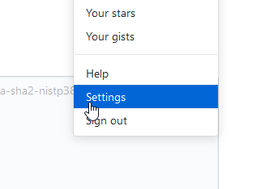
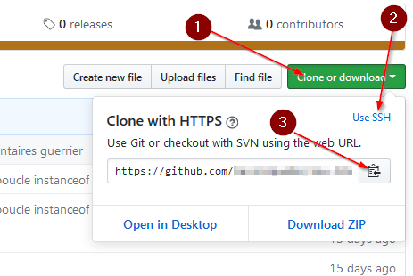

# Mémo - SSH Github
## *Campus Numérique 2018 - Véronique*
#
## Ressources en ligne

1. Récupérer la clé publique sur notre dossier `P`

    * Aller dans le dossier `.ssh`

        
    * Ouvrir le fichier `id_rsa.pub` (la clé publique) avec un éditeur
    * Copier la clé complète

2. Ajouter la clé publique sur Github

    * dans le dossier `Settings` 

        
    * Choisir `SSH and GPG keys` dans `Personal settings`
    * Créer une nouvelle clé SSH `New SSH key`
    * Donner un nom et coller la clé publique
    * valider avec le mot de passe de Github

3. Récupérer le lien ssh d'un projet git

    * Sur Github, aller sur le projet
    * Cliquer sur `Clone or download` (1)
    * Choisir `use SSH` (2)
    * Copier l'url du projet (3)

        

 4. Modifier la connexion https en ssh sur un projet du PC

    * Dans le projet, aller sur le `.git`
    * Ouvrir le fichier `config` dans un éditeur (WordPad)
    * remplacer l'ancienne url (https) par la nouvelle en ssh

5. Répondre `Yes` à la première connexion sur github

6. Pour les nouveaux projets, utiliser systématiquement l'url en SSH

